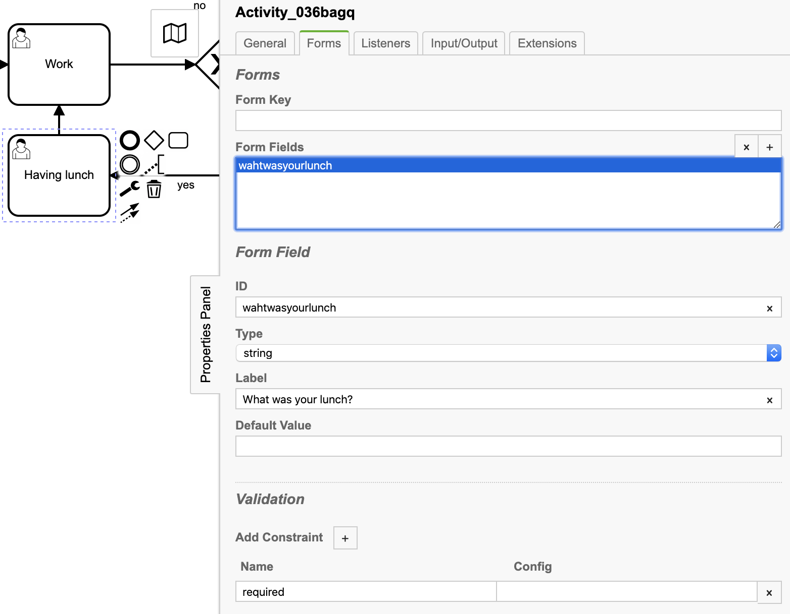
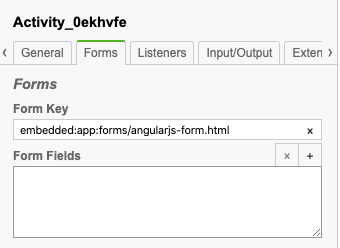
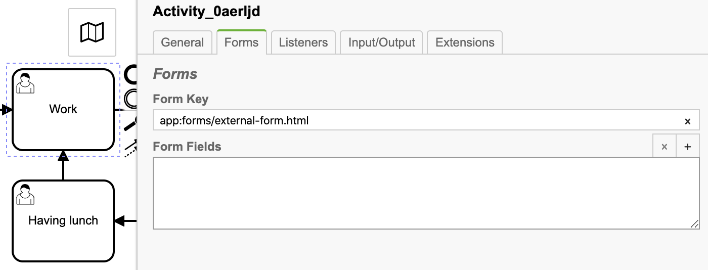
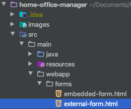
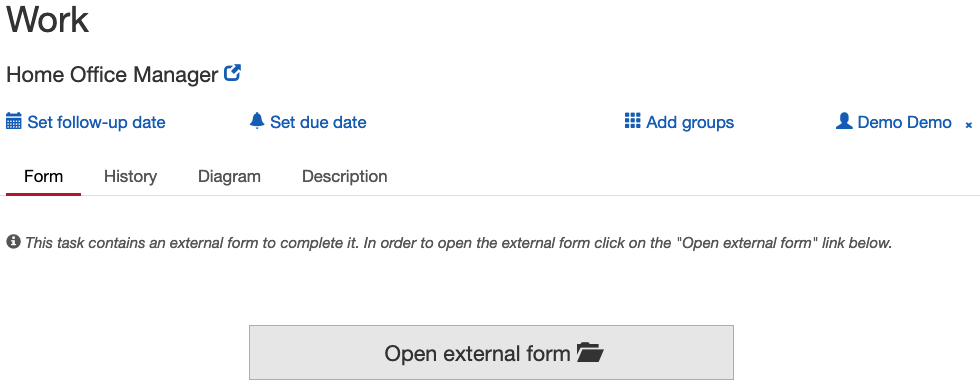

# home-office-manager
Manage your home office day in an easy way
An excercise to explain the three **User Task Forms** from Camunda
___
### Java delegate
[Camunda Documentation: Delegation Code][1]
___
### Service task to Manual Task
Difference between [Manual Task][2] and [User Task][3]
___
### User task with user interface
#### Version 1 - Generated Task Forms

In Camunda Modeler click on a User Task Activity.
Click on the tab 'Forms' and add a 'Form Field'. 



In Camunda go to the 'Tasklist' claim the user task and fill in the fields.


* [Camunda Documentation: Generated Task Forms][4]
#### Version 2 - Embedded Task Forms (Angular.js)

Install **AngularJS** and the **Camunda BPM JS SDK** as dependencies into your project using *bower*:

Install *bower* through NPM with `npm install -g bower`

For **AngularJS**:

```bash
bower install angular#1.2.32 --save
```

For **Camunda BPM JS SDK**:

```bash
bower install camunda-bpm-sdk-js --save
```

On the given *User Task* in the **Camunda Modeler**, set the following value into the *Form Key* field:

`embedded:app:forms/your-form.html`



Now you should be able to use AngularJS functions and more in your embedded form.

Example in *angularjs-form.html*

```html
<form role="form" name="form">

    <label for="input-field">set to 'true' to buy some food</label><br>
    <input type="text"
           cam-variable-name="enoughFood"
           cam-variable-type="Boolean"
           ng-model="enoughFood"
           id="input-field">
    <p ng-show="enoughFood">
        Your input: <b>{{ enoughFood }}</b> <br>
        <sub>some sweet Two-Way Binding by AngularJS :o</sub>
    </p>

</form>
```

[Camunda Documentation: Embedded Task Forms][5]

[Standalone Usage of JS SDK with AngularJS][6]

#### Version 3 - External Task Forms (Custom)
In Camunda Modeler click on a User Task Activity.
Click on the tab 'Forms' and add in the 'Form Key' field 'app:forms/external-form.html'.



Check and understand the file src/main/webapp/forms/embedded-form.html



In Camunda go to the 'Tasklist' claim the user task and click on 'Open external form'



[Camunda Documentation: External Task Forms][7]
___
### Literature and sources
* [Camunda Documentation: Delegation Code][1]
* [Camunda Documentation: Manual Task][2]
* [Camunda Documentation: User Task][3]
* [Camunda Documentation: Generated Task Forms][4]
* [Camunda Documentation: Embedded Task Forms][5]
* [Standalone Usage of JS SDK with AngularJS][6]
* [Camunda Documentation: External Task Forms][7]

[1]: https://docs.camunda.org/manual/latest/user-guide/process-engine/delegation-code/
[2]: https://docs.camunda.org/manual/7.8/reference/bpmn20/tasks/manual-task/
[3]: https://docs.camunda.org/manual/7.8/reference/bpmn20/tasks/user-task/
[4]: https://docs.camunda.org/manual/latest/user-guide/task-forms/#generated-task-forms
[5]: https://docs.camunda.org/manual/latest/user-guide/task-forms/#embedded-task-forms
[6]: https://github.com/camunda/camunda-bpm-examples/tree/master/sdk-js/browser-forms-angular
[7]: https://docs.camunda.org/manual/latest/user-guide/task-forms/#external-task-forms
