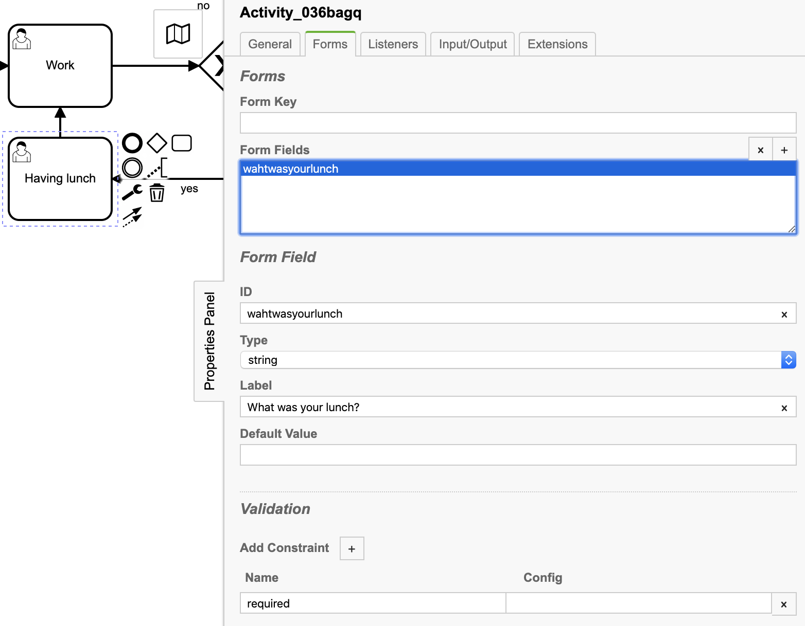
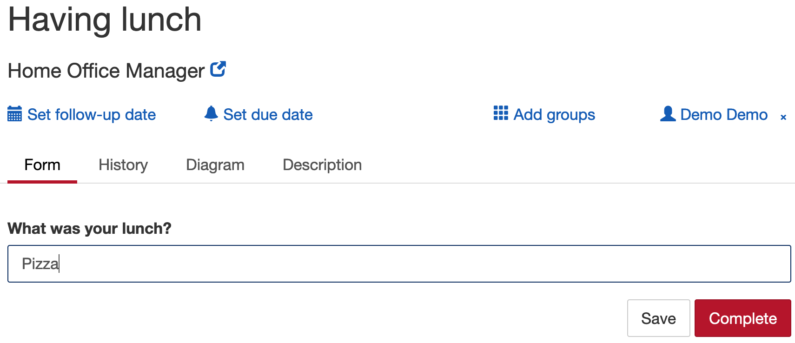

# home-office-manager
Manage your home office day in a easy way
___
### Task 1 - Java delegate
Example in the code:
* Java class: EnoughFoodDelegate
* BPMN Activity: Check if you have enough food

[Camunda Documentation: Delegation Code][1]
___
### Task 2 - Service task to Manual Task
Diffrence between [Manual Task][2] and [User Task][3]
___
### Task 3 - User task with user interface
#### Version 1 - Generated Task Forms
In Camunda Modeler click on a User Task Activity.
Click on the tab 'Forms' and add a Form Field. 

In Camunda go to the 'Tasklist' Claim the user task and fill in the fields

#### Version 2 - Angular.js
#### Version 3 - Custom
___
### Task 4 - Presentation
#### Difference between internal and external tasks
The process engine supports two ways of executing service tasks:
1. Internal Service tasks: Synchronous invocation of code deployed along with a 
	process application
2. External tasks: Providing a unit of work in a list that can be polled by workers

The first option is used when code is implemented as Delegation Code or as a Script. 
By contrast, external (service) tasks work in a way that the process engine publishes 
a unit of work to a worker to fetch and complete. We refer to this as the external 
task pattern.
___
### Literature and sources
* [Camunda Documentation: Delegation Code][1]
* [Camunda Documentation: Manual Task][2]
* [Camunda Documentation: User Task][3]

[1]: https://docs.camunda.org/manual/latest/user-guide/process-engine/delegation-code/
[2]: https://docs.camunda.org/manual/7.8/reference/bpmn20/tasks/manual-task/
[3]: https://docs.camunda.org/manual/7.8/reference/bpmn20/tasks/user-task/
